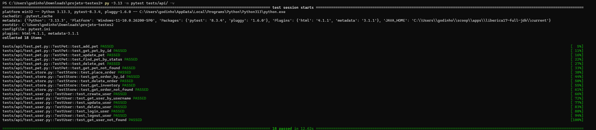
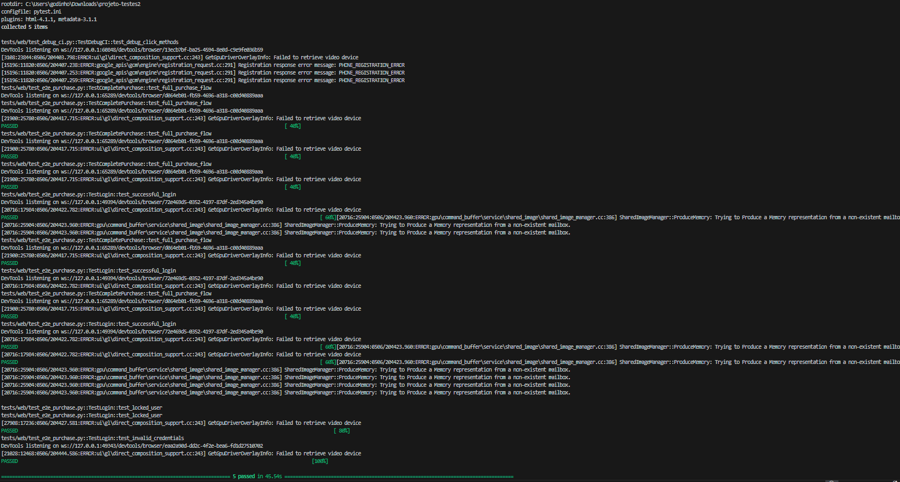
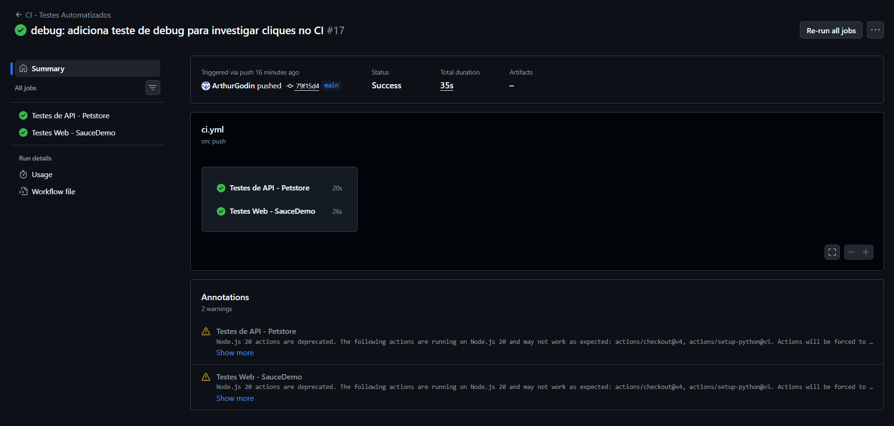

# Projeto de Testes Automatizados

Projeto de automação de testes cobrindo **API REST** (Swagger Petstore) e **Web E2E** (SauceDemo), com integração contínua via GitHub Actions.

## Tecnologias

- **Python 3.12**
- **pytest** — framework de testes
- **requests** — chamadas HTTP para testes de API
- **Selenium WebDriver** — automação de navegador
- **webdriver-manager** — gerenciamento automático do ChromeDriver
- **GitHub Actions** — pipeline de CI

## Estrutura do Projeto

```
├── tests/
│   ├── api/                    # Testes de API
│   │   ├── conftest.py         # Fixtures (base URL)
│   │   ├── test_pet.py         # Endpoints /pet
│   │   ├── test_store.py       # Endpoints /store
│   │   └── test_user.py        # Endpoints /user
│   └── web/                    # Testes Web
│       ├── conftest.py         # Fixture do Selenium/Chrome
│       ├── pages/              # Page Objects
│       │   ├── base_page.py    # Classe base
│       │   ├── login_page.py
│       │   ├── inventory_page.py
│       │   ├── cart_page.py
│       │   └── checkout_page.py
│       └── test_e2e_purchase.py  # Testes E2E
├── .github/workflows/ci.yml   # Pipeline CI
├── requirements.txt
├── pytest.ini
└── README.md
```

## Instalação

```bash
# Clonar o repositório
git clone https://github.com/ArthurGodin/Projeto-testes.git
cd Projeto-testes

# Criar ambiente virtual
python -m venv venv
source venv/bin/activate   # Linux/Mac
venv\Scripts\activate      # Windows

# Instalar dependências
pip install -r requirements.txt
```

## Execução dos Testes

```bash
# Executar todos os testes
pytest

# Apenas testes de API
pytest tests/api/ -v

# Apenas testes Web
pytest tests/web/ -v
```

## Cenários de Teste

### API — Swagger Petstore (`https://petstore.swagger.io/v2`)

| Módulo | Cenários |
|--------|----------|
| **Pet** | Criar pet, buscar por ID, atualizar, buscar por status, deletar, buscar inexistente |
| **Store** | Criar pedido, buscar por ID, deletar, consultar inventário, buscar inexistente |
| **User** | Criar usuário, buscar por username, atualizar, deletar, login, logout, buscar inexistente |

### Web — SauceDemo (`https://www.saucedemo.com`)

| Cenário | Descrição |
|---------|-----------|
| **Compra completa (E2E)** | Login → adicionar produto → carrinho → checkout → finalizar compra |
| **Login válido** | Autenticação com credenciais corretas |
| **Usuário bloqueado** | Tentativa de login com usuário locked_out |
| **Credenciais inválidas** | Tentativa de login com dados incorretos |

## Design Patterns

- **Page Object Model (POM)**: Cada página do SauceDemo possui sua própria classe, encapsulando localizadores e ações. Isso facilita a manutenção e reutilização.

## Prints do Funcionamento

### Testes de API (18 passed)


### Testes Web (5 passed)


### Pipeline CI — GitHub Actions


## CI/CD — GitHub Actions

A pipeline executa automaticamente em todo push/PR para `main` ou `master`:

- **Job 1**: Testes de API (sem dependência de navegador)
- **Job 2**: Testes Web (com Chrome headless)

Os dois jobs rodam em paralelo para otimizar o tempo de execução.


